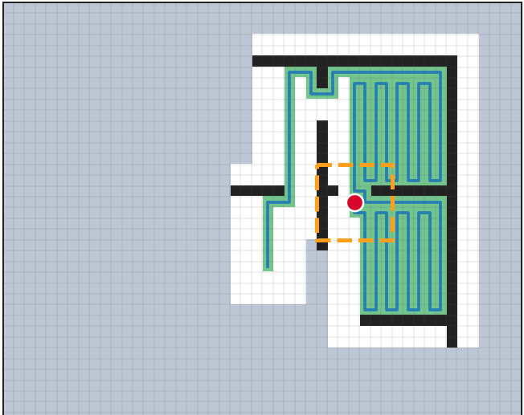
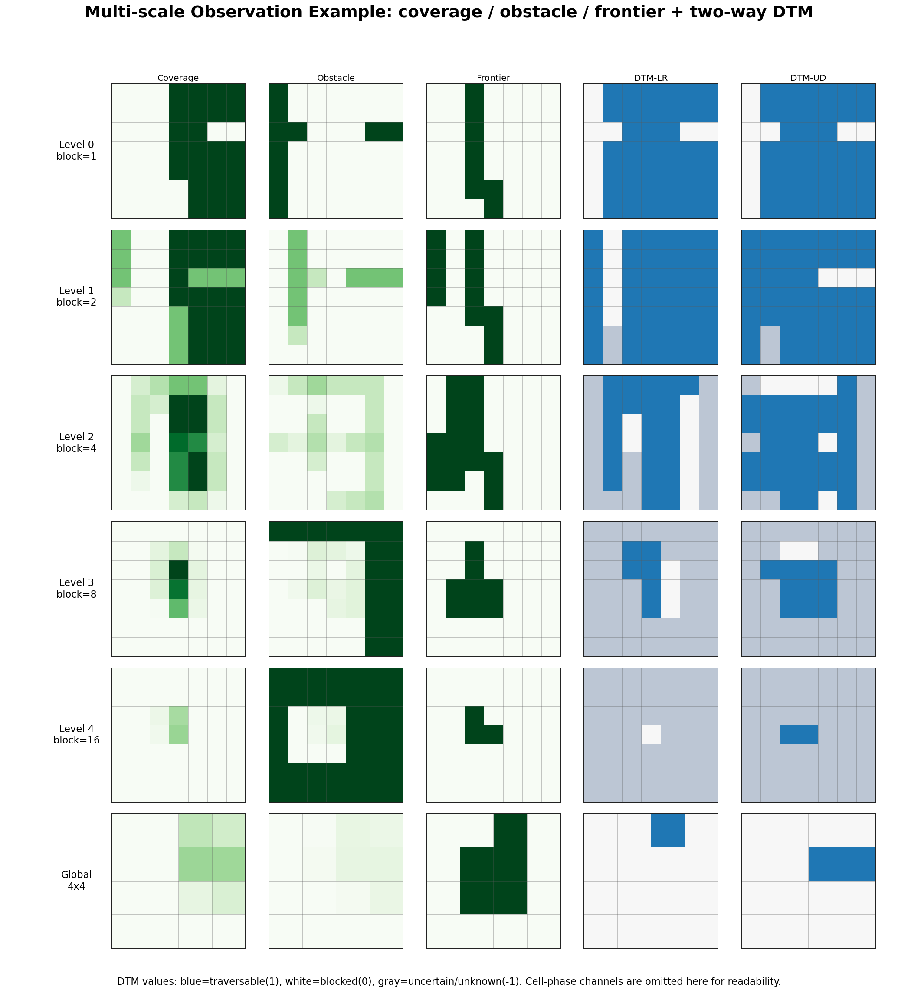
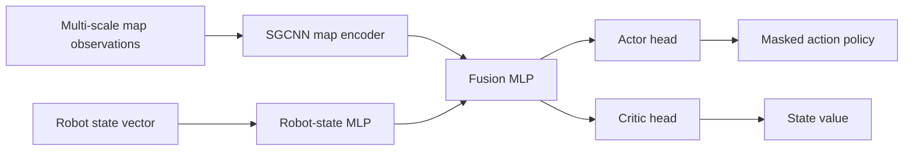

# RL-Based Online Coverage Path Planning

This repository implements an online coverage path planning (CPP) system that trains a reinforcement learning agent to cover unknown grid environments with a limited-range sensor. The main research focus is whether a compact Directional Traversability Map (DTM) representation can help a policy learn more efficient coverage behavior than occupancy-only map observations.

## Highlights

- **Online CPP setting**: the agent observes only a local sensor range and incrementally builds a known map during an episode.
- **Maskable PPO training**: invalid moves are masked during policy optimization using Stable-Baselines3 / sb3-contrib.
- **Multi-scale map observation**: coverage, obstacle, frontier, and optional DTM channels are encoded across local-to-global map scales.
- **SGCNN policy encoder**: scale-grouped CNN features are fused with robot-state features before actor-critic heads.
- **Paper-oriented mixed curriculum**: training maps are generated from shape-grid, macro-detail, trail-grid, and room-corridor families.
- **Baseline vs DTM comparison pipeline**: paired-seed training and log analysis scripts are included for fair ablation experiments.

## Problem Setting

The robot must cover all reachable free cells in a 2D grid map. At each step, it receives a partial observation from a narrow sensor range and chooses one of four movement actions. The objective is not only to maximize final coverage, but also to reduce inefficient revisits, loops, and unnecessary turns.



## Method

The baseline policy receives multi-scale occupancy-style map features. The DTM variant adds directional traversability channels to represent whether movement between coarse cells is structurally possible. This gives the policy access to connectivity information without adding expensive online search-based reward shaping.





## Experimental Results

The table below summarizes a representative paired training comparison between an occupancy-only baseline and a DTM-enhanced policy. These are pilot training-log metrics used to guide the paper experiments; the final paper protocol uses the mixed curriculum runner and fixed terminal-metric logging.

| Curriculum Window | Baseline Coverage | DTM Coverage | Baseline Final Coverage | DTM Final Coverage |
|---|---:|---:|---:|---:|
| L2, chunks 1-10 | 0.4761 | **0.5715** | 0.7628 | **0.9462** |
| L3, chunks 11-20 | 0.6402 | **0.6532** | 0.9881 | **0.9995** |
| L4, chunks 21-39 | **0.6737** | 0.6638 | 0.9732 | **0.9966** |
| L4 tail, chunks 31-39 | **0.7032** | 0.6333 | **0.9989** | 0.9931 |

Key observations:

- DTM improves early-stage learning efficiency, especially in L2 maps where structural guidance is most helpful.
- DTM reaches very high final coverage in the L3/L4 stages while keeping the policy architecture almost unchanged.
- Late-stage rollout coverage can favor the baseline, so the final comparison should use fixed test maps and terminal metrics such as `final_coverage`, `success_90/95/99`, and `step_to_90/95/99`.
- Search-based revisit-burden reward shaping was tested but rejected for the paper setting because it adds expensive per-step graph search and gives only minor gains.

## Paper Training Protocol

The current paper runner trains baseline and DTM policies with the same seed, reward, curriculum, PPO hyperparameters, and model size. DTM experiments only add the DTM observation channels.

Baseline:

```bash
PYTHONUNBUFFERED=1 python run_ppo_mixed_curriculum_paper.py \
  --run-tag paper_mixed128_50m_baseline_seed101 \
  --seed 101 \
  --device cuda
```

DTM-six:

```bash
PYTHONUNBUFFERED=1 python run_ppo_mixed_curriculum_paper.py \
  --run-tag paper_mixed128_50m_dtm_six_seed101 \
  --seed 101 \
  --device cuda \
  --include-dtm \
  --dtm-output-mode six
```

For long 128x128 experiments, the recommended chunk setting is `--chunk-timesteps 1000000` with `--max-episode-steps 30000`, so that terminal episode metrics are produced within each training chunk.

## Repository Structure

| Path | Purpose |
|---|---|
| `run_ppo_mixed_curriculum_paper.py` | Paper training wrapper for mixed map curricula |
| `run_ppo_shapegrid_curriculum_paper.py` | Chunked curriculum runner and map-pool generation |
| `run_ppo_sb3_paper.py` | Maskable PPO training entry point |
| `paper_training/` | Paper-specific environment wrappers, metrics, and callbacks |
| `learning/observation/` | Multi-scale CPP observations and DTM construction |
| `learning/common/encoders.py` | SGCNN and fused map/state encoders |
| `map_generators/` | Procedural map generators for curriculum training |
| `log_analysis/` | Scripts for rollout and chunk-level comparison plots |

## Implementation Notes

- PPO uses `MaskablePPO` when action masking is enabled.
- The xlarge model preset uses SGCNN conv channels `(64, 128)`, level embeddings of size `256`, robot-state MLP `(256, 256)`, and fusion MLP `(1024, 1024)`.
- The DTM-six model adds only a small parameter increase over the baseline encoder, so performance differences mainly reflect the observation representation rather than model capacity.
- Training logs are written to `reports/progress.jsonl` and chunk-level CSV/JSON files for post-hoc analysis.

