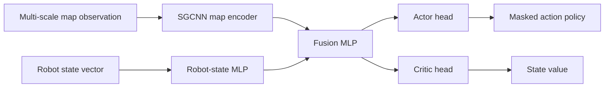

# 강화학습 기반 Online Coverage Path Planning

이 저장소는 제한된 센서 범위만 사용하는 로봇이 미지의 2D 격자 환경을 탐색하며 전체 free space를 효율적으로 커버하도록 학습하는 Coverage Path Planning(CPP) 프로젝트입니다. 핵심 연구 주제는 기존 occupancy 기반 관측에 Directional Traversability Map(DTM)을 추가했을 때, 정책이 더 구조적인 이동 가능성 정보를 활용해 효율적인 coverage behavior를 학습할 수 있는지 검증하는 것입니다.

## 핵심 내용

- **Online CPP 문제 설정**: 로봇은 전체 지도를 알지 못하고, 좁은 센서 범위로 관측한 정보를 누적해 known map을 구성합니다.
- **Maskable PPO 기반 학습**: 불가능한 이동은 action mask로 제거하고, Stable-Baselines3 / sb3-contrib 기반 PPO로 정책을 학습합니다.
- **Multi-scale 지도 관측**: coverage, obstacle, frontier, DTM 정보를 여러 scale의 지도 채널로 구성합니다.
- **SGCNN 정책 네트워크**: scale별 지도 feature를 Scale-Grouped CNN으로 인코딩하고, robot-state feature와 결합해 actor-critic head로 전달합니다.
- **논문용 mixed curriculum**: shape-grid, macro-detail, trail-grid, room-corridor 계열의 procedural map을 사용해 난이도별 curriculum을 구성합니다.
- **Baseline vs DTM 비교 실험**: 같은 seed, 같은 reward, 같은 PPO hyperparameter 조건에서 DTM 관측의 효과를 비교합니다.

## 문제 정의

로봇의 목표는 reachable free cell을 가능한 빠르고 안정적으로 모두 방문하는 것입니다. 매 step마다 로봇은 제한된 센서 범위 내의 정보만 관측하고, 상하좌우 네 방향 중 하나의 행동을 선택합니다. 단순히 최종 coverage를 높이는 것뿐 아니라, 같은 영역을 반복해서 방문하는 overlap, loop, 불필요한 turn을 줄이는 것이 중요합니다.

## 접근 방법

Baseline은 multi-scale occupancy 기반 지도 관측을 사용합니다. DTM variant는 coarse cell 사이의 방향별 이동 가능성을 나타내는 traversability channel을 추가합니다. 이를 통해 정책은 매 step마다 별도의 graph search reward를 계산하지 않아도, 지도 구조상 어느 방향으로 진행 가능한지에 대한 정보를 관측으로 직접 활용할 수 있습니다.

## Baseline vs DTM 실험 요약

아래 표는 현재까지의 paired training log 중 DTM의 개선 효과가 뚜렷하게 나타난 대표 지표를 발췌한 것입니다. 최종 논문용 결과는 동일한 fixed test map set에서 terminal metric으로 재평가하는 방식으로 정리할 예정입니다.

| 구간 | 비교 지표 | Baseline | DTM | 개선 폭 |
|---|---|---:|---:|---:|
| L2, chunks 1-10 | mean coverage | 0.4761 | **0.5715** | **+20.0%** |
| L2, chunks 1-10 | final coverage | 0.7628 | **0.9462** | **+24.0%** |
| L3, chunks 11-20 | mean coverage | 0.6402 | **0.6532** | **+2.0%** |
| L3, chunks 11-20 | final coverage | 0.9881 | **0.9995** | **+1.2%** |
| L4, chunks 21-39 | final coverage | 0.9732 | **0.9966** | **+2.4%** |

해석:

- DTM은 L2 구간에서 baseline보다 빠르게 coverage를 끌어올렸고, final coverage도 크게 개선되었습니다.
- L3 이후에는 두 모델 모두 높은 coverage에 도달하지만, DTM이 더 안정적으로 1.0에 가까운 final coverage를 보였습니다.
- DTM-six 모델은 baseline보다 입력 채널만 소폭 증가하며, 전체 네트워크 구조와 PPO 설정은 동일하게 유지됩니다.
- per-step BFS 기반 revisit-burden reward shaping도 실험했지만, 계산 비용 대비 효과가 작아 최종 논문 방향에서는 제외했습니다.

## 학습 방법

논문용 실험은 baseline과 DTM-six 모델을 동일한 학습 조건에서 비교하는 paired experiment로 구성했습니다. 두 모델은 같은 map curriculum, reward, PPO hyperparameter, random seed, model size를 사용하며, DTM-six는 관측 채널에 directional traversability map만 추가합니다.

| 항목 | 설정 |
|---|---|
| 문제 유형 | Online coverage path planning |
| 지도 크기 | 128 x 128 grid |
| 센서 범위 | Chebyshev radius 3 |
| 행동 공간 | 상, 하, 좌, 우 4방향 discrete action |
| 총 학습량 | 50M environment steps |
| Chunk 구성 | 1M steps/chunk, 총 50 chunks |
| Train map pool | chunk당 12개 map 생성 |
| Episode horizon | 최대 30,000 steps |
| 병렬 환경 | 28개 SubprocVecEnv |
| PPO rollout | `n_steps=256`, `batch_size=512`, `n_epochs=4` |
| Discount / GAE | `gamma=0.99`, `gae_lambda=0.95` |
| Optimizer 설정 | learning rate `3e-4`, entropy coefficient `0.01` |
| Policy network | SGCNN xlarge encoder + actor-critic MLP |
| Action constraint | invalid action masking 사용 |

학습 curriculum은 쉬운 map에서 시작해 점진적으로 복잡한 구조를 포함하도록 구성했습니다. 각 chunk마다 12개의 새로운 train map pool을 생성하고, episode가 끝날 때마다 현재 chunk의 map pool 안에서 다음 지도로 교체합니다.

| 학습 구간 | Curriculum 구성 |
|---|---|
| 0-5M steps | L1 100% |
| 5-15M steps | L1 20% + L2 80% |
| 15-30M steps | L2 20% + L3 80% |
| 30-50M steps | L3 20% + L4 80% |

각 chunk의 map pool은 `shape_grid`, `macro_detail`, `trail_grid`, `room_corridor` 계열 generator로 구성됩니다. 이를 통해 단순 장애물 배치부터 복도형 구조, trail형 구조, macro/detail obstacle이 섞인 구조까지 다양한 CPP 상황을 학습에 포함합니다.

평가는 학습 중 rollout metric과 별도의 고정 test map set 평가를 구분합니다. 학습 로그에서는 coverage 증가 속도와 overlap/loop 경향을 확인하고, 최종 비교는 fixed test map에서 `final coverage`, `success_90/95/99`, `step_to_90/95/99` 같은 terminal metric으로 정리합니다.

## Repository 구조

| 경로 | 설명 |
|---|---|
| `run_ppo_mixed_curriculum_paper.py` | 논문용 mixed curriculum 학습 wrapper |
| `run_ppo_shapegrid_curriculum_paper.py` | chunk 단위 curriculum runner 및 map pool 생성 |
| `run_ppo_sb3_paper.py` | Maskable PPO 학습 entry point |
| `paper_training/` | 논문 실험용 environment wrapper, metric, callback |
| `learning/observation/` | multi-scale CPP observation 및 DTM 구성 |
| `learning/common/encoders.py` | SGCNN 및 map/state fusion encoder |
| `map_generators/` | curriculum map generator |
| `log_analysis/` | rollout 및 chunk-level 비교 분석 도구 |

## 구현 메모

- action mask를 사용할 때는 sb3-contrib의 `MaskablePPO`를 사용합니다.
- xlarge model은 SGCNN conv channel `(64, 128)`, level embedding `256`, robot-state MLP `(256, 256)`, fusion MLP `(1024, 1024)`로 구성됩니다.
- DTM-six는 baseline 대비 encoder parameter 증가가 매우 작기 때문에, 성능 차이는 주로 model capacity보다 observation representation 차이로 해석할 수 있습니다.
- 학습 로그는 `reports/progress.jsonl` 및 chunk별 CSV/JSON 파일로 저장되어 후처리 분석에 사용됩니다.
