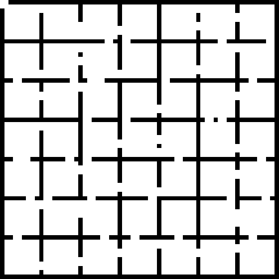
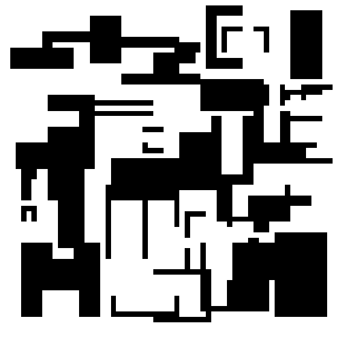
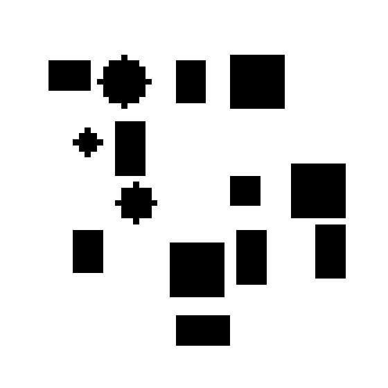

# Map Generators

맵 생성기를 한 곳에서 관리하기 위한 폴더입니다.

## 1) `indoor` generator
- 방-복도(격자 방) 구조.
- 벽/문을 만들고, 문은 1개 또는 2개(비율 기반)로 뚫림.
- 방 연결은 spanning-tree + 추가 연결로 전체 연결성을 유지.

샘플:



## 2) `random` generator
- 기존 `MapGenerator` 기반 stage 랜덤 장애물.
- 직사각/U-shape/false-hole 등 랜덤 조합.
- 일부 겹침 허용 후, 도달 불가 free 영역은 장애물로 정리.

샘플:



## 3) `shape_grid` generator (new)
- 격자 앵커 위에 도형 장애물(네모/세모/원)을 배치.
- 도형 크기, 위치(jitter), 방향(삼각형)은 랜덤.
- 도형끼리 겹침/근접(clearance) 금지로 깔끔한 배치 유지.

샘플:



## 빠른 사용법

샘플 3종 생성:

```bash
python map_generators/generate_samples.py --size 64 --seed 101
```

코드에서 직접 사용:

```python
from map_generators import build_indoor_map, build_random_map, build_shape_grid_map

indoor = build_indoor_map(size=64, seed=101)
random_map = build_random_map(size=64, seed=101, stage=3)
shape_grid = build_shape_grid_map(size=64, seed=101)
```
